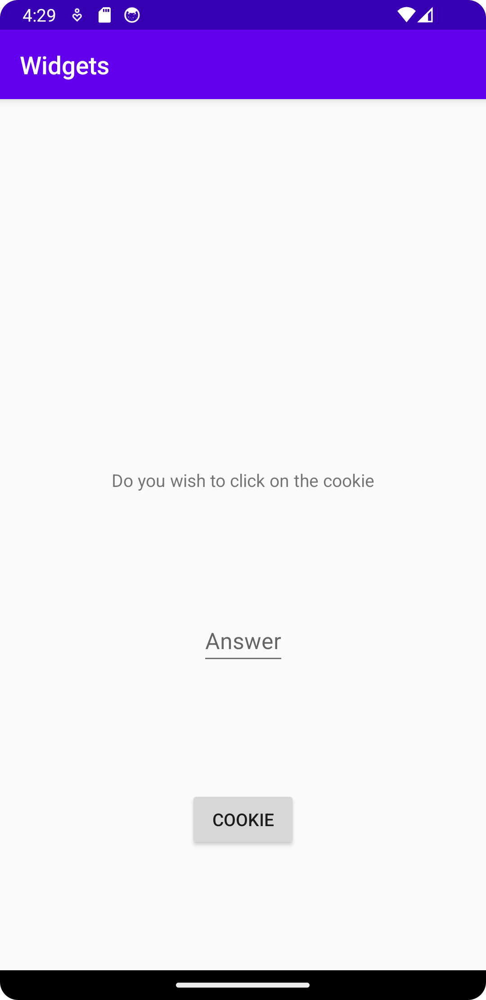

# Rapport


## Följande grundsyn gäller dugga-svar:
 
- Jag la till en button view i den existerande constraintViewen och gav den ett ID

```
    android:id="@+id/cookieButton"
    android:text="Cookie"
```
- Jag gjorde samma sak med editText och TextView
- Jag la till constraints till alla olika views och använde wrap content
  - start och end blev constrained till parent
  - top och bottom blev constrained till viewen över eller under
- till exempel button view:
```
        app:layout_constraintTop_toBottomOf="@id/editTextView"
        app:layout_constraintBottom_toBottomOf="parent"
        app:layout_constraintStart_toStartOf="parent"
        app:layout_constraintEnd_toEndOf="parent"
```
- Button view ligger längst ner vilket betyder att dens Top är constrained till viewen över (TextView)
- Buttons bottom är constrained till parent eftersom ingen annan view finns under



